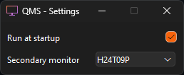

# QMS - QuickMonitorSwitcher

One click on/off secondary monitors

  
  

Uses displayswitch.exe to toggle your screen in windows and DDCCI commands to turn off / on your monitor.  
It is really basic and will maybe be extended to support multiple monitors one day.

## Disclaimer

**QMS relies on DDCCI commands, which may vary in effectiveness depending on your hardware.**  
**I am not responsible for any issues or damages resulting from its use.**  
**Please ensure your monitor supports power mode control before use.**

## Usage

- In the settings, select which monitors should receive DDCCI ON/OFF commands.
- You can now toggle secondary monitors using tray icon (single left click on icon, or right click -> enable / disable).

Your chosen monitors are saved for next run.

## Command line interface

Since i'm building as a windows gui app to avoid console, there will be no output in terminal.

Commands:
- `--list`: Will create a file `monitors.txt` in current working directory, with monitors name, state, and primary state.
- `--enable "monitor1" "monitor2"`: displayswitch to extend and send ddcci power on signal to selected monitors.
- `--disable "monitor1" "monitor2"`: displayswitch to extend and send ddcci power off signal to selected monitors.
## Help

- **My monitor goes black even when unchecked:**

When toggling monitors, QMS send two signals: software signal, and hardware signal.

Software signal is a built in windows application (`displayswitch.exe`) to change your monitors configuration (show only on 1, clone, show only on 2 etc).  
Software signal is always sent, no matter the checkbox state.

- **My monitor does not appear in the list:**

For convenance, your primary monitor (aka the default one) does not appear in the monitors list.  
Some entry level monitors are not detected when they are disabled. I'll fix it the day i find a solution.

- **My monitor does not turn off:**

Refer to disclaimer.

- **What is the point of this utility when i can just windows + P?:**

Windows + P invoke displayswitch.exe.  
Displayswitch.exe does not send on / off signal to your monitors.

## To-do

- cli commands (list, enable, disable)
